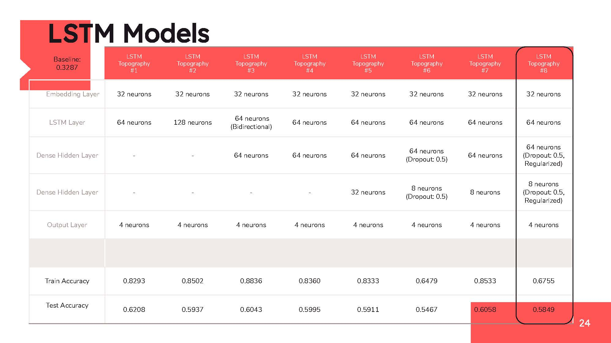

## Yelp Restaurant Recommendations from Multiclass Classification Language Model Using Yelp Restaurant Reviews

This project was released on May 14th, 2021.  Data used was data gathered up until this date. 

### Table of Contents

| Folder Number | Folder Name | Folder Description and Contents |
| --- | --- | --- |
| 1 | README | The README file contains the executive summary and overview of teh project as a whole. |
| 2 | Code | The Code folder contains all python notebooks for cleaning the data and modeling the data |
| 3 | Presentation | The presentation folder contains all images that were used in the presentation as well as a pdf copy of the powerpoint presentation. |  

### README Sections

- Problem Statement
- Executive Summary
- Dataset
- Modeling Process
- Conclusions and Areas for Improvements
- File Structure
- Sources

---

#### Problem Statement

The goal of this project was to train a model to use restaurant reviews on Yelp to accurately predict whether a restaurant has a `Casual` and/or `Classy` ambience, and then to use that language model to evaluate user inputted text to predict the type of experience the user wanted - a `Casual` and/or `Classy` experience.  This prediction would then be inserted into a recommender system in order to recommend the appropriate restaurants to the user. 

---
#### Executive Summary 

- Background 

Yelp is a desktop/web/mobile platform that connects people with great local businesses.  Users can contribute reviews of almost every type of local business from restaurants, boutiques, salons, dentists, mechanics, plumbers, etc.

It was founded in 2004 by former PayPal employees Russel Simmons and Jeremy Stoppelman and has grown in usage and funding over the years. From expanding to Europe and Asia, to becoming a public company in March 2012, it is a huge platform that engages a lot of users every single month.  It has nearly 184 million reviews on its platform, and is the 44th most visited website in the US.  It also boasts of having 178 million unique visitors monthly across its mobile/desktop/app platform. In fact, 45% of its customers are likely to check Yelp reviews before visiting a business. All this to say, that the platform has very large user engagement and that user engagement can be used to bring better recommendations to customers. 

- Project Goal 

The goal of this project was to train a model to use restaurant reviews on Yelp to accurately predict whether a restaurant has a `Casual` and/or `Classy` ambience, and then to use that language model to evaluate user inputted text to predict the type of experience the user wanted - a `Casual` and/or `Classy` experience.  This prediction would then be inserted into a recommender system in order to recommend the appropriate restaurants to the user. 

- Metrics 

The metrics we used to evaluate the multiclass model was accuracy because there wasn't a single metric that was more important to optimize. A user could potentially be disappointed in both cases of false positives or false negatives. (Either being led to believe a restaurant was classy when it was really casual, or being led to believe that a restaurant was casual even though it was really classy.)  A case could be made to optimize for precision, and that could be incorporated into a future iteration of this project. See more about this in the 'Areas for Improvements' section. 

- Modeling 

To train a model that would use restaurant reviews to classify a restaurant as casual and/or classy, a number of NLP models were used.  Among these included a Decision Tree, Support Vector Machines, Random Forests Classifier, Bagging Classifier, as well as an AdaBoost classifier. Finally, a more advanced sequence model called, Long-Short Term Memory (LSTM) model was used to get better accuracy scores.  Finally the predicted ambience of the restaurant along with a few other user-chosen attributes of a restaurant were put into a recommendation system, and the recommendation system used cosine distances to find other restaurants that were the most similar to the user's inputs. 

- Findings 

The findings from this modeling and prototype of an idea, was that LSTM was a much stronger model for predicting ambience using text data only, and that cosine distances as a recommender system was useful in this project. 

---

#### Dataset

Data source: [Yelp Open Dataset](https://www.yelp.com/dataset)

Data was collected from the Yelp Open Dataset website.  Data on this site is periodically updated and was created to support academic use of the dataset. This site includes many features including restaurant attributes, reviews, user ratings, user photos, and many more features. 

The dataset was easily downloadable and was extracted by unzipping the .tar file and then unzipping the tar.gz file. 

Very little feature engineering was required, though a considerable amount of data cleaning and data extracting was required.  Often times attributes of a restaurant or categories of a restaurant were stored as dictionaries or a dictionary within other dictionaries.  Considerable amount of time and effort was devoted to extracting these attributes and creating binary variables from them. 

I also decided to subset the dataset to only include businesses that were open, restaurants establishments, and those establishments located in Ohio.  This state was chosen purely based on the number of observations in the dataset. The number of observations within this state was about 100,000 observations which was a considerable number in relation to my compute power. Therefore, states with more observations were not considered due to issues of computing power and memory. 

---

#### Modeling Process

The target variable was a multi-class target variable with the classes:
* **Neither casual nor classy** ambience
* **Casual only** ambience
* **Classy only** ambience 
* **Both casual and classy** ambience

The first step of the modeling process was to use basic supervised learning models to predict this ambience target variable.  The models used are described below: 
* Decision Tree
* Support Vector Machine 
* Random Forest Classifier 
* Random Forest Classifier pruned to a max depth of 5
* Bagging Classifier 
* AdaBoost Classifier

**Here are the results from each model**: 

Many of these models were grossly overfit and were not improving upon the baseline score.  Therefore, I decided to deploy a more advanced NLP model that is used for sequence data or data where order matters.  I decided to try the Long-Short Term Memory (LSTM) Neural Network model, that is a variety of the Recurrent Neural Network family.  Roughly 13 different neural network topographies were experimented with.  The best 8 topographies are displayed below. 

**Results from the LSTM Model**

**Recommendation System** 

Finally a recommendation system was deployed by creating vectors from the ambience prediction as well as from user-chosen attributes of a restaurant.  Once these vectors were created, the cosine distance was calculated between these vectors and restaurants vectors that had the shortest distance to the user's vector were then recommended to the user. 

---

#### Conclusions and Areas for Improvement

This project was a way to prototype the idea of using a language model on a user-input text section in order to improve restaurant recommendations.  That being said, there are a lot of ways to expand this prototype and improve its functionality. 

- Future Model Improvements

The LSTM model was performing only okay, and one way to enhance this model would be to expand and use other NLP models such as BERT and take the average of these two models together to create an ensemble model to improve accuracy scores.  In addition, in this future iteration it might be worthwhile to optimize for the precision score instead of accuracy. 

- Gather More/Different Data

More data always improves the model and gathering more city-specific data will expand the prototype to other cities and other states.  In addition, the creation of a 'restaurant ambience review' section on the Yelp platform might be a way to collect more text data specifically oriented towards a restaurant's ambience. 

- Expand to Other Cities

This model can be improved upon by either gathering more data on certain cities and states, or instead including more cities and states in the initial data cleaning. 

- Recommender Improvements

Finally, the recommendation part of this could be expanded to include more features in each restaurant vector, and to expand the target class to predict more ambience classes.  The Yelp dataset includes the following additional ambience classes: `Trendy`, `Upscale`, `Touristy`, `Hipster`, `Divey`, `Intimate`, and `Romantic`

---

#### File Structure

* Code: 
    * 01_convert_b_json_csv - the business json file that contains business id matched to the business name is converted into a csv file, and subsets the dataframe to include businesses that are open and businesses that are categorized under `Food`, `Restaurant`, and `Bar`.
    * 02_convert_review_json_csv - the review json file that contains restaurant reviews matched with the business id is converted into a csv file
    * 03_recommender - this file cleans the data to create a data frame ready to be transformed into a cosine distance recommender system
    * 04_cleaning_reshaping_reviews - this file merges the business csv and the review csv and cleans and preps the dataframe to be ready for NLP processing
    * 05_nlp_eda_cleaning_reviews - this file takes the merged dataframe and performs NLP processing on it such as tokenizing and stemming, and then creates some data visualization charts showing the most common words in each target class. 
    * modeling: 
        * 01_modeling - this file performs the basic supervise modeling using classifiers such as decision trees, random forests, SVMs, AdaBoost, and Bagging
        * 02\*-03\*_modeling_tf_lstm - these files performs the LSTM modeling with each notebook being an LSTM model with a slightly different topography or neural network structure. 
        * best_model\* - this file is the best LSTM model that was found
        * yelp_app_demo - this file is the workflow of how the streamlit file should work.  This performs the entire streamlit workflow but in a python notebook. 
        * yelp_app.py - this file is the streamlit application deployment
        * yelp_processing.py - this file is the yelp_app_demo file turned into a .py file and optimized for use in the yelp_app.py streamlit application file.
        * saved_model - this folder is the best LSTM Tensorflow saved to be imported in the yelp_app.py streamlit application file
* Miscellaneous-scratch - this folder contains scratch python notebooks that created during brainstorming
* Presentation: 
    * imgs - this folder contains all the images that were included in the powerpoint presentation 
    * Yelp Capstone Presentation.pdf - this file is the final powerpoint presentation as a pdf file

---

#### Sources

* [Yelp Open Dataset](https://www.yelp.com/dataset)
* [Yelp LinkedIn](https://www.linkedin.com/company/yelp-com/)
* [Yelp Statistics](https://review42.com/resources/yelp-statistics//)
* [Yelp Wikipedia Page](https://en.wikipedia.org/wiki/Yelp)
* [Blog about LSTM](https://intellipaat.com/blog/what-is-lstm/)
* [LSTM Wikipedia Page](https://en.wikipedia.org/wiki/Long_short-term_memory)
* [Introduction to LSTM on Analytics Vidhya Blog](https://www.analyticsvidhya.com/blog/2017/12/fundamentals-of-deep-learning-introduction-to-lstm/)